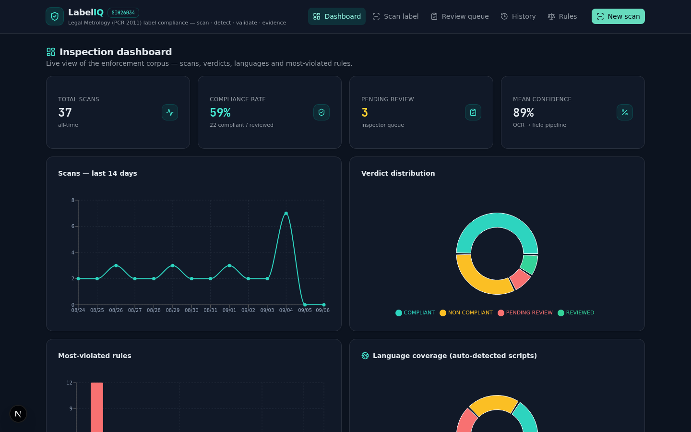
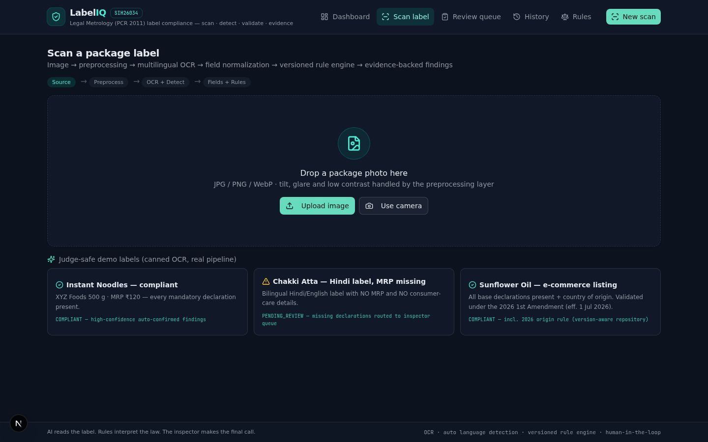
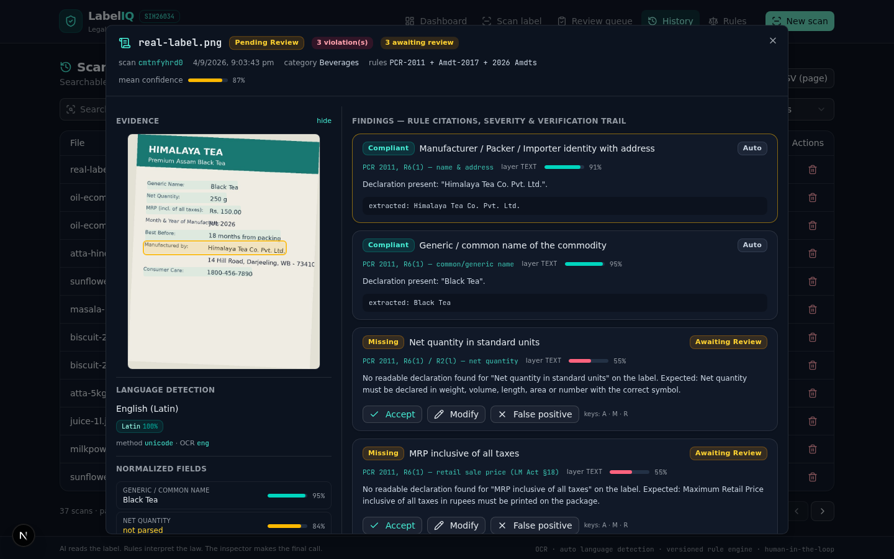
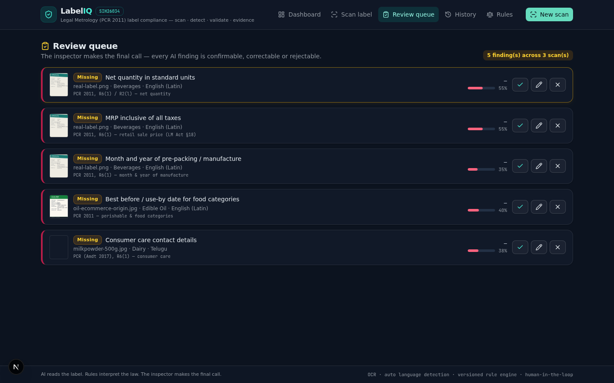
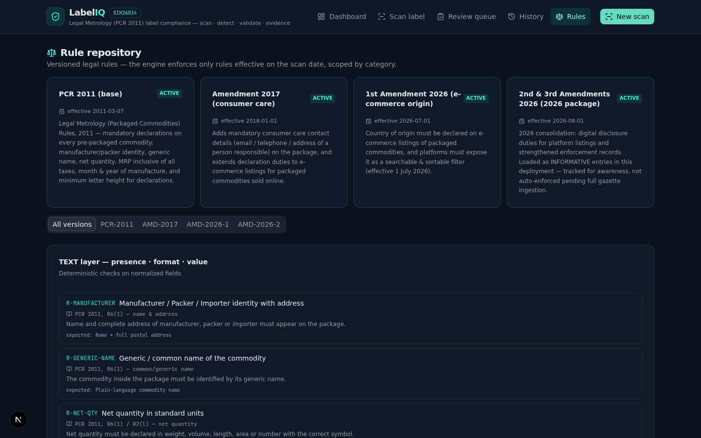

# LabelIQ — Label Compliance Scanner

**SIH 26034 · Legal Metrology (Packaged Commodities) label verification**

LabelIQ turns any smartphone photo of a pre-packaged commodity's label into a structured compliance verdict. It runs OCR on the image, detects the label's language automatically (9 Indic scripts + English), extracts the mandatory declarations required by the **Legal Metrology (Packaged Commodities) Rules, 2011**, checks each one against a versioned rules engine, and routes uncertain results to a human review queue — producing a signed, exportable compliance report.

```
Photo → Preprocess → OCR (multi-script) → Field extraction → Rules engine → Triage → Human review → PDF report
```

## Why

Every pre-packaged commodity sold in India must carry mandatory declarations — manufacturer identity, generic name, net quantity, MRP (inclusive of all taxes), month/year of manufacture, expiry, consumer-care contact. Inspectors currently verify these **by eye, label by label** — slow, error-prone, unscalable, and with no audit trail. LabelIQ makes that check a **point-and-shoot operation** with a machine-verifiable evidence trail.

## Screenshots

| Dashboard | Scan view |
|---|---|
|  |  |

| Scan detail (evidence + verification) | Review queue (human-in-the-loop) |
|---|---|
|  |  |

| Rules browser |
|---|
|  |

## Features

- **Camera / upload scanning** with client-side preprocessing (grayscale → contrast → Otsu binarization → rotation → scaling) — an OpenCV-style quality gate before OCR runs.
- **Automatic language detection** for 9 Indic scripts (Devanagari, Bengali, Gurmukhi, Gujarati, Odia, Tamil, Telugu, Kannada, Malayalam) + English, via Tesseract OSD plus Unicode script-ratio analysis; the label is re-OCR'd with the right language packs. Bilingual labels (e.g. Hindi + English) are handled natively.
- **Field extraction & normalization**: MRP, net quantity, dates (absolute + relative like "best before 9 months from packaging"), manufacturer, weights/sizes, batch — with per-field confidence.
- **Deterministic rules engine**: 13 rules in 3 layers (TEXT / VISUAL / CATEGORY), 4 rule versions with a timeline, ENFORCED vs INFORMATIVE severity, and an auditable `ruleRef` for every finding (e.g. *PCR 2011, R6(1)*).
- **Triage + human-in-the-loop**: only low-confidence or violation findings enter the review queue; inspectors **Accept / Modify / Reject** (keyboard A/M/R), and every correction triggers deterministic re-validation and recomputes the scan status.
- **Evidence-first**: every finding carries its bounding box on the source image; scan detail shows the OCR evidence overlay.
- **Export**: one-click branded **PDF compliance report** (verdict, fields table, findings with severity colors, package photo) and **CSV** for record-keeping.
- **Analytics dashboard**: KPIs, compliance trends, category mix, language mix, pending-review workload.

## Architecture

```
src/
  app/                      Next.js App Router (single-route app)
    api/scans/              POST create (server-side extract + engine = single source of truth)
    api/scans/[id]/         GET / DELETE
    api/findings/[id]/      PATCH accept / modify / reject (+ status recompute)
    api/stats/              dashboard aggregates
  components/app/           dashboard, scan-view, review-queue, history, rules-browser, scan-detail
  components/ui/            shadcn/ui primitives
  lib/
    ocr/                    preprocess.ts (canvas CV pipeline) + pipeline.ts (OSD → eng → script re-OCR)
    language/detect.ts      script-ratio detection, bilingual labels
    rules/                  repository (rule versions) → extract (normalizers) → engine (evaluator)
    client/report.ts        jsPDF compliance report generator
    db.ts                   Prisma client singleton
  prisma/schema.prisma      Scan + Finding models (SQLite)
```

**Stack**: Next.js 16 (App Router) · TypeScript · Tailwind CSS 4 + shadcn/ui · Prisma + SQLite · TanStack Query · tesseract.js 7 · jsPDF · recharts

**Design decisions** (the "why"):

- *Client-side OCR*: photos and OCR run in the inspector's browser — images never leave the device, which keeps the scan private, works offline after pack download, and removes server GPU/OCR costs.
- *Server-side evaluation*: field extraction + rules engine run in the API route on save — one source of truth, so the DB can never disagree with the UI about compliance logic.
- *Deterministic engine first*: rules are data (versioned, inspectable in the Rules browser) rather than a black-box model — findings are explainable and auditable by design; AI/OCR confidence only triages, it never decides compliance alone.
- *Human-in-the-loop*: the engine flags; the inspector decides. Every accepted correction is stored (`reviewedValue`, `reviewedAt`) — that's the audit trail.

## Getting started

Prerequisites: **Bun** (or Node 20+) and a browser.

```bash
# 1. install
bun install            # or: npm install

# 2. database
cp .env.example .env   # creates prisma/db/custom.db (SQLite)
bunx prisma generate
bun run db:push        # create the schema

# 3. (optional) seed 33 realistic demo scans
bun run db:seed

# 4. run
bun run dev            # or: npm run dev
```

Open <http://localhost:3000>. For a quick demo without a camera, the Scan view includes **3 built-in demo labels** (compliant English, non-compliant Hindi, e-commerce origin) that synthesize OCR results locally.

> Tesseract language packs (eng, hin, …) download on first use from the CDN and are cached by the browser.

## API

| Method | Route | Purpose |
|---|---|---|
| POST | `/api/scans` | Create scan: image + OCR output → server-side extraction + rules engine → findings |
| GET | `/api/scans` | List / search / filter / paginate scans |
| GET | `/api/scans/{id}` | Scan with findings |
| DELETE | `/api/scans/{id}` | Delete scan (cascades findings) |
| PATCH | `/api/findings/{id}` | Inspector action: `ACCEPT` / `MODIFY` (re-validates) / `REJECT` |
| GET | `/api/stats` | Dashboard KPIs + chart aggregates |

## Project layout

- `src/lib/rules/repository.ts` — rule definitions across 4 versions (timeline shown in the Rules browser)
- `src/lib/rules/extract.ts` — field normalizers (MRP, net qty, dates incl. relative dates, size/weight)
- `src/lib/rules/engine.ts` — evaluator + triage thresholds + re-validation
- `src/lib/ocr/preprocess.ts` — canvas-based CV: grayscale, contrast, Otsu threshold, rotate, scale
- `src/lib/client/report.ts` — jsPDF report: verdict band, metadata, evidence image, fields + findings tables

## Roadmap

- Bounding-box field selection on the evidence image (MRP / batch / dates) for challenging pre-printed labels
- VLM (vision-language model) fallback extraction for low-quality photos, with a pluggable provider layer + retry/backoff
- Barcode / QR cross-checks against batch and expiry data
- Inspector analytics export for enforcement planning

## License

[MIT](LICENSE)
